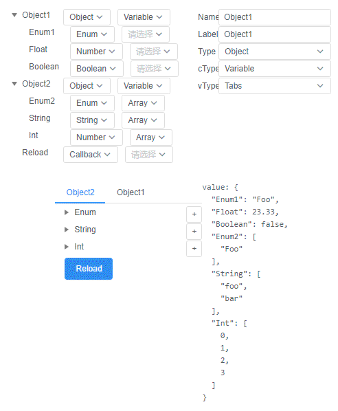

## data driven ui component

<-- WIP -->

```js
schema: {
  Enum: {
      type: "Enum",
      label: "Enum",
      enums: ["Foo", "Bar"]
  },
  String: {
      type: "String",
      placeholder: "placeholder",
      label: "Last Name"
  },
  Number: {
      type: "Number",
      placeholder: "Age",
      label: "Age",
      min: 0,
      max: 100
  },
  Event: {
      type: "Event",
      label: "Submit"
  }
}

```

## preview


